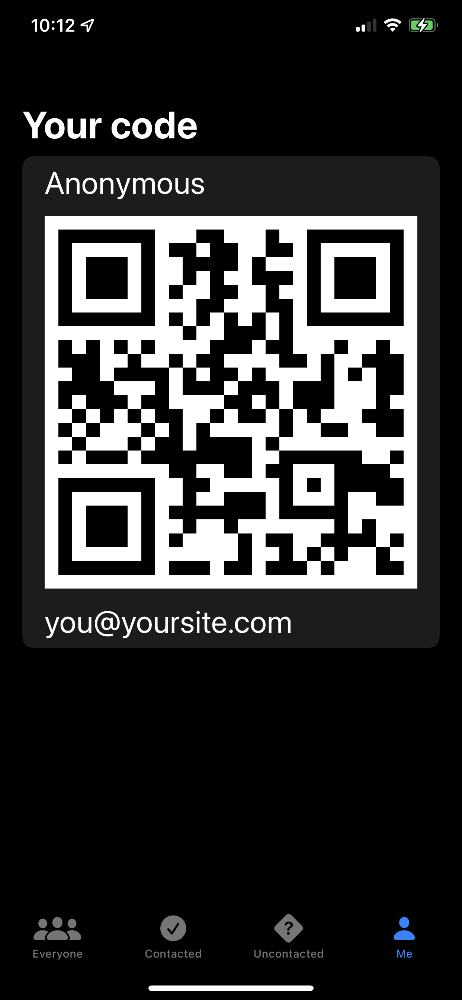

# HotProspects
Project 16 days 79-85 of 100 days of SwiftUI

This project was designed to show the integration of a dynamic QR code creator and scanner, storign information in json, custom swipe commands, importing and using a package, and navigation tabs.

The challenges are completed by not currently labeled. Please feel free to look through the code to find my solutions to the problems.

  

The app is interesting, but the formatting of the data requires that each person that wants to share information will have to have the same app on hand. It would probably be best to include a system for bringing an app clip to a new user to get the data out quick. 
